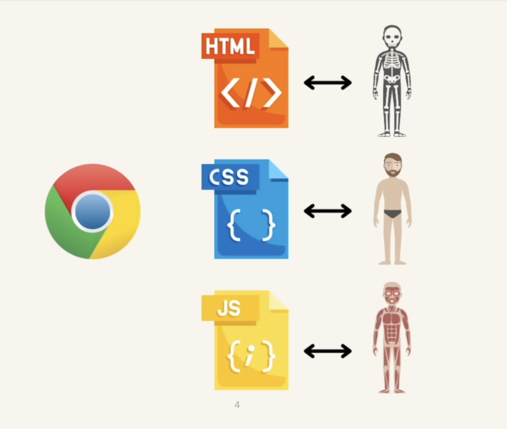

# Web Development Notebook

## How do the websites actually work

- 
- 

## Basics of HTML

- HTML stands for `Hypertext Markup Language`
- HTML is the standard markup language for creating web pages
- HTML describes the structure of a web page
- HTML consists of a series of elements
- HTML elements tell the browser how to display the content
- A website can be create without CSS and JavaScript, but without HTML its existence is not possible.
- HTML determines what is on the page; the content of the page is in there

## Basics of CSS

- CSS stands for `Cascading Style Sheets`
- CSS describes how HTML elements are to be displayed on the screen, paper, or in other media
- CSS saves a lot of work. It can control the layout of multiple web pages all once
- CSS is the layout of the web page.

## Basics of JavaScript

- JavaScript often abbreviated as `JS`, is a programming language (semi object oriented, functional and procedural)
- JavaScript originates from 1995, and is often considered the most widely used programming language
- JavaScript is a lightweight, interpreted, or just-in-time compiled programming language with first-class functions (functions can be passed as a variable)
- JavaScript is an interpreted language, which means that the computer understands it while running it
- JavaScript can be used on both server side and client side of applications
- JavaScript defines what the web page can do; the behavior of a web page and how it can interact with the user or the backend

## HTML

### HTML Basics

- HTML is not a programming language, we can't write any logic or perform any calculations with the help of HTML.
- HTML is a markup language, which helps us to the define the structure of a web page and the representation of a content.

- We can also add attributes in HTML tags, e.g.

    ```html
    <p class="editor-note">My cat is very grumpy</p>
    ```

    
- Attributes provides more power/functionality to a tag e.g. `class` attribute is a global attribute which means this attribute can be used in all the tags.

### The head tag
